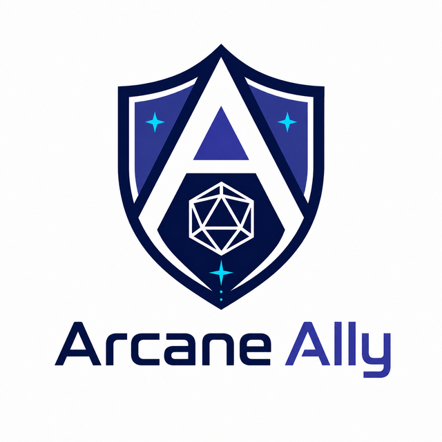

# Arcane Ally

<p align="center">
  
</p>

A high-performance, self-hosted companion application for D&D 5e. Real-time party management, AI-powered content generation, and a full DM command center — all running on your local hardware.

## Requirements

- Node.js 20 or newer
- npm with lockfile support
- Ollama only when using AI-assisted imports or generation

## Development Quick Start

```bash
git clone https://github.com/jbright471/Arcane-Ally.git
cd Arcane-Ally

cp server/.env.example server/.env
```

Backend terminal:

```bash
cd server
npm ci
npm start
```

Frontend terminal:

```bash
cd client
npm ci --legacy-peer-deps
npm run dev
```

- Frontend dev server: `http://localhost:5173`
- Backend API and Socket.io gateway: `http://localhost:3001`
- Default DM PIN comes from `server/.env`; change the sample value before inviting players.
- The repository contains no campaign data. The backend creates a blank database on first start.

> **Proxy note:** The checked-in Vite configuration expects the backend to be reachable as `dnd-party-sync-backend:3001`, matching the container-network deployment. For host-only development, point the two proxy targets in `client/vite.config.ts` to `http://localhost:3001`. See [Self-Hosting](./docs/SELF_HOSTING.md) for supported topology details.

## The Stack

- **Frontend:** React 19, TypeScript, Vite, Tailwind CSS v4, shadcn/ui, Radix UI
- **Backend:** Node.js (Express), Socket.io (real-time sync), Better-SQLite3
- **AI Layer:** Local Ollama integration for PDF parsing, item stat extraction, homebrew generation, lore generation, and actionable entity creation
- **Deployment:** Multi-stage backend image plus an externally served frontend/reverse proxy; local development uses Vite + Express

## Core Features

### Real-Time Synchronization
Every HP change, condition, spell slot, buff, and dice roll broadcasts instantly to all connected clients. The one-way state pipeline ensures consistency:

```
Client emit → Server handler → DB mutation → broadcastPartyState() → All screens update
```

HP changes flash red for damage and green for healing on character cards. Incoming server state is normalized before rendering so connected screens converge on the same campaign state.

Dice rolls can be public, private, secret, or super-secret. Secret modes are generated server-side and routed only to the DM, with optional masked acknowledgement for the rolling player.

### Character Management
- **D&D Beyond Import** — paste a character URL to pull stats, equipment, spells, and inventory from the DDB API
- **PDF Import** — upload a character sheet PDF; the AI parser extracts stats, classes, abilities, and spells
- **Re-Sync** — pull latest changes from D&D Beyond without creating duplicates
- **Manual Creation** — build a character from scratch with full stat entry

### Interactive Character Sheets
- **Clickable Ability Scores** — click any stat to roll d20 + modifier, broadcast to the DM's Roll Feed
- **Roll Visibility Controls** — players can roll publicly, privately to the DM, secretly with a masked acknowledgement, or super-secretly with no local result shown
- **Skill & Save Proficiency Dots** — per-skill and per-save proficiency imported from D&D Beyond; dots show none / half / proficient / expertise with amber highlight for expertise
- **Weapon Actions** — click to roll attack (d20 + proficiency + ability mod) and damage simultaneously; weapon stats imported from D&D Beyond
- **Spell Casting** — one-click casting with automatic slot consumption, concentration tracking, and upcasting support
- **Dice Roll History** — collapsible per-character roll history card (last 30 rolls) showing type badge, label, and total
- **Condition Badges** — real-time condition display with DM-applied/removed states and duration countdown
- **0 HP Automation** — damage that drops a character to 0 HP automatically applies `unconscious`; healing above 0 HP removes that automatic unconscious state
- **Rest Management** — Short Rest (hit dice spending dialog) and Long Rest (full HP/slot/feature restoration)
- **Offline HP Queue** — HP changes made while offline are queued in IndexedDB and replayed automatically on reconnect
- **Global Feature Toggles (Grim-Rage)** — interactive toggles for character-specific states (e.g., Barbarian's Rage, Blood Hunter rites) that automatically broadcast defensive adjustments (resistances/immunities) to the server's core rules parser.

### Compendium & Homebrew Manager
- **Split-pane layout** with searchable entity index (left) and stat block inspector/editor (right)
- **Official SRD tab** — search the open5e API for 5e SRD monsters, spells, and magic items
- **Homebrew tab** — local database of custom entities
- **Clone to Homebrew** — copy any SRD entity to your homebrew library for editing
- **AI Generation** — describe a monster, spell, or item; the AI generates a full stat block matching the schema
- **Draft review** — AI-generated entities load as editable drafts; tweak the math before saving
- **Spawn to Combat** — click "Add to Combat Tracker" on any monster to auto-roll initiative and add to the tracker with full stat passthrough

### DM Command Center

**God-Eye View** — compact cards for every party member showing HP bars, AC, conditions, and quick +/-5 HP buttons.
- **Combat State Inspector** — real-time, transparent breakdown of a character's state. DM-only glassmorphism modal revealing exact mathematical breakdown of Armor Class, Ability Scores, and Active Conditions.

**Initiative Tracker** — automatic initiative rolling (auto-roll d20 + DEX mod for all combatants), turn advancement, visibility toggles, HP tracking, and manual reordering. Three spawn methods: Quick Spawn, Compendium, and AI Lore Console.
- **Smart Encounter Recovery** — total persistence for encounter flow. The active combat round and turn index are continuously synced to the SQLite database. Initiative automatically resumes on server restart or client reconnect.
- **Player Miniature Sidebar** — a slide-out drawer on the left side of the screen containing connected player miniatures, enabling visual status telemetry (HP, AC, Speed, conditions) and interactive spell slot pips (click to consume/restore slots via WebSockets) with quick +/-5 HP adjusters.
- **Encounter Cast View** — a standalone read-only cast window located at `/encounter/:id/cast` designed with a dark-fantasy aesthetic. It displays the live party state and initiative order without interactive clutter, perfect for a secondary monitor or TV screen.
- **Role-Safe Combat Views** — hidden monsters stay DM-only. Cast screens show exact party HP and broad monster health labels; registered players see exact party HP while exact monster HP follows the campaign permission.
- **Multi-Phase Bosses** — configure phase-specific HP and AC from a monster's initiative row, choose how HP carries into each phase, and preserve or explicitly clear active conditions and buffs.
- **Linked Concentration Effects** — concentration buffs remember their caster and spell instance, then clear from every affected character or monster when concentration ends.

- **AoE Multi-Target Effects** — select multiple combatants with checkboxes, then click the AoE button to open a multi-row effect builder (damage, heal, add/remove condition). The authenticated `/api/v1/effects/bulk-apply` endpoint reports a result for each target and groups related timeline records under one action ID.
- **Quick Encounter Automations** — one-click "Dismiss Dead" removes all dead tracker entries; "Clear All Conditions" wipes conditions from every PC. Both accessible from the DM-only Quick Actions popover.
- **DM-Requested Hidden Saves** — pending saving throws can be requested as public, private, secret, or super-secret rolls. Hidden saves still auto-resolve pass/fail effects without leaking totals to players.

**AI Lore Console** — creative AI assistant with preset prompts (Room Desc, NPC Idea, Loot Drop, Combat). Generates atmospheric D&D content with **actionable response cards**:
- **Items** — "Send to Party Loot" instantly drops the item into the shared loot pool
- **Monsters** — "Add to Combat Tracker" spawns with auto-rolled initiative and full stats
- **NPCs** — "Save to Notes" stores the NPC in party notes

Buttons disable after use to prevent duplicate spawns.

**DMRollFeed** — aggregated live feed of all player dice rolls with filter toggles (ATK / DMG / SKILL / SAVE / INIT / HP / LOOT / PRIV). Private, secret, and super-secret rolls are grouped as non-public while still showing full context to the DM.

**Campaign Automation Policies** — open **Automation -> Policies** to control unconscious handling, concentration behavior, bloodied detection, modifier propagation, ammunition use, condition ticks, initiative sync, turn triggers, auras, curated reactions, and combat-history retention. Existing behavior remains enabled after upgrades; ammunition tracking is deliberately opt-in.

**Encounter Builder & Prep Packs** — pre-plan encounters with named monster groups. DMs can now import complete "Prep Packs" (JSON bundles containing monsters, maps, notes, and sandboxed automation triggers) by pasting them directly into the Encounter Library.

**DM Prep Panel** — per-character and per-encounter sticky notes accessible from the God-Eye View.

- **Effect Preset Library** — reusable DM-created templates for spells, conditions, monster auras, and environmental modifiers, with search, editing, and multi-target application from a dedicated drawer.
- **Import Guardrails & Safety Diffs** — Real-time validation layer analyzing incoming character stats (Level, HP, AC, ability scores) from D&D Beyond or PDFs. Flags rule anomalies (Danger/Warning/Info) and holds player-initiated updates in a staged DM approval queue (`pending_imports`) with side-by-side comparative views.

### Party Loot Pool
- DM drops items from homebrew library, custom creation, or AI generation
- **Need / Greed / Pass voting** — DM can open a vote on any item; players vote and the server auto-resolves when all connected players have voted (need beats greed; random tiebreak within tier); DM can also force-resolve at any time
- Configurable permission modes: Open, DM Approval, Owner Only
- Real-time sync across all clients

### Audit Log & Event System
- **Effect Preview & Consent** — DMs can dry-run effects before committing. Players get a real-time toast to **[Accept]** or **[Reject]** incoming state mutations.
- **Effect Timeline** — append-oriented combat ledger grouped by round. Undo adds a correction event and marks the original record as reversed instead of deleting it
- **Encounter Archives** — ending combat preserves its timeline under the encounter name. DMs can browse, search, paginate, and export completed encounters without mixing them into the current live timeline
- **Explainable Character Automation** — configurable bloodied thresholds add visible status and timeline events, while modifier propagation can be paused without removing the displayed buffs
- **Linked Ammunition Tracking** — optional per-campaign tracking consumes only the inventory item explicitly named on a manual weapon, avoiding guesses or silent resource loss
- **Archive Retention** — keep every encounter by default, or retain a chosen number of encounters or days from **Automation -> Policies -> Combat History**
- **Curated Reactive Automation** — built-in reaction handlers can respond to effect events; the current handler set includes `retributive_healing` for self-healing reactions triggered by outgoing healing
- **Audit Log** — human-readable descriptions of every mutation with DM-accessible undo (event reversal)
- **Idempotency Guards** — every mutation carries a unique request ID; duplicate events from websocket reconnects are automatically deduplicated
- **Permission System** — configurable rules for loot claiming, cross-player effects, and inventory transfers

### Battlemap
- **Token Drag** — tokens represent PCs, monsters, and NPCs as percentage-positioned circles on the map; drag-and-drop with pointer capture API; positions sync to all clients via `move_token` socket
- **HP Overlays** — each token shows a live HP bar correlated from initiative state (green/amber/red)
- **DM Tools** — show/hide hidden tokens; "Sync from Initiative" spawns tokens for all active combatants

### World & Discovery
- **Interactive World Map** — shared overworld with DM-controlled markers and discovery points
- **Quest Tracker** — quest lifecycle management visible to the party
- **World Panel** — time of day, weather (AI-generated), and ambient state
- **Soundboard** — atmospheric audio effects

### Communication
- **WebRTC Voice Chat** — built-in voice communication with speaking indicators
- **DM Whisper** — private messages from DM to individual players
- **Party Notes** — shared notes with categories (lore, npc, quest, general)
- **Rules Assistant** — floating chat widget connected to the AI for rules lookups

### AI-Powered Features
- **Character PDF Parsing** — extract stats from uploaded character sheet PDFs
- **Item Description Parsing** — analyze item text to extract AC bonuses, damage, stat modifiers
- **Homebrew Generation** — AI creates full stat blocks for monsters, spells, and items
- **Actionable Lore** — AI responses include structured entity data with one-click game injection
- **Loot Generation** — context-aware item creation
- **Weather Generation** — atmospheric weather descriptions
- **Session Recap** — AI-generated session summaries from the action log

### Equipment System
- **Slot-based layout** — main hand, off hand, armor, ring, amulet, head, hands, feet.
- **QuickEquipParser** — paste item text; AI extracts stats and creates the item.
- **ManualItemForm** — full manual item creation with type, rarity, damage, AC, and stat bonuses.
- **D&D Beyond sync** — equipment imported and slotted automatically.
- **Dynamic Rules Engine**:
  - **Level-Scaling Formulas** — Base AC, AC bonuses, speeds, initiatives, ability scores, and saving throws/skills can be defined using formulas like `1 + floor(level / 5)` or `floor(level / 2)` that auto-scale fluidly.
  - **Condition-Based Disables** — Gear can specify conditions under which they are suppressed (e.g., dropping shield AC bonus when paralyzed).
  - **Stacking & Deduplication** — Enforces limits on duplicate items (e.g., non-stacking Rings of Protection) and duplicate buffs (e.g. merging duplicate Bless effects, keeping the highest).

## App Guidebook

An in-app, task-first documentation hub at `/guide` with searchable player, DM, mechanics, AI/homebrew, hosting, and troubleshooting guides.

## Documentation

- [First Run](./docs/FIRST_RUN.md)
- [Documentation Index](./docs/README.md)
- [Self-Hosting & Upgrades](./docs/SELF_HOSTING.md)
- [Architecture](./docs/ARCHITECTURE.md)
- [Interactive Rolls & Roll Visibility](./docs/PHASE_7.1_INTERACTIVE_ROLLS.md)
- [Automation Policies & Combat History](./docs/AUTOMATION_AND_COMBAT_HISTORY.md)
- [Client README](./client/README.md)
- [Legacy Parser References](./files/README.md)
- [Security Policy](./SECURITY.md)
- [Contributing](./CONTRIBUTING.md)
- [Changelog](./CHANGELOG.md)

## Self-Hosting

Core campaign state, the database, and configured Ollama processing run on your hardware. D&D Beyond imports and Open5e searches use external services when invoked. The repository ships a multi-stage `Dockerfile`, but no public `docker-compose.yml`; keep host paths, addresses, and real secrets in private deployment configuration.

1. **Environment Config**
   ```env
   PORT=3001
   DM_PIN=1234
   JSON_BODY_LIMIT=15mb
   OLLAMA_URL=http://your-ollama-host:11434
   OLLAMA_MODEL=your-installed-model
   # Optional: DB_PATH=/absolute/path/to/dnd.db
   ```

2. **Local Development**

   Backend terminal:
   ```bash
   cd server && npm ci && npm start
   ```

   Frontend terminal, from the repository root:
   ```bash
   cd client && npm ci --legacy-peer-deps && npm run dev
   ```

3. **Access**
   - Frontend dev server: `http://localhost:5173`
   - Backend API and Socket.io gateway: `http://localhost:3001`
   - Open **DM Dashboard** and enter the configured `DM_PIN`; expired saved sessions return to this login screen.

4. **Container / Portainer Notes**
   - The backend default port is `3001` (`PORT` in `.env`).
   - The Vite dev server default port is `5173`.
   - Production Portainer/Compose deployments should route `/api` and `/socket.io` traffic to the backend service on port `3001`.
   - The current Docker image starts the backend. Although it builds and copies `client/dist`, Express does not serve those files; serve the frontend with a separate static web service or reverse proxy.
   - If the entire `server/` directory is bind-mounted into an Alpine-based container, mount `/app/server/node_modules` as a separate container volume. Native `better-sqlite3` binaries cannot be shared safely between host Linux and Alpine runtimes.
   - Avoid resolving dependencies on every container start. Build them into the image, or use `npm ci` with the committed lockfile for a development container.

5. **Container Health & Telemetry**
   - **Telemetry API** — `/api/health` exposes V8 process uptime and memory usage metrics.
   - **Memory Exhaustion Loop Guard** — An automated script (`healthcheck.js`) monitors memory and triggers container exits (exit code 1) if V8 heap utilization exceeds 500MB, preventing memory leak loops.
   - **Lightweight 3-Stage Docker Build** — The container is optimized to strip compiler libraries (`python3`, `make`, `g++`) from the final run image, keeping container size at a bare minimum.

## Security & Privacy Notes

Arcane Ally is intended for self-hosted, local-first play. Before publishing or sharing a deployment:

- Keep real `.env` files private; commit only `.env.example` templates.
- Do not commit SQLite databases, PDFs, private keys, certificates, or character export files.
- The repo ignore rules exclude environment files, databases and journals, runtime data/uploads/backups, PDFs, common private key and certificate formats, character exports, `node_modules`, and build output.
- Change `DM_PIN` from the sample value before exposing the app outside a trusted LAN.
- Prefer local Ollama for AI features when campaign privacy matters.
- Do not expose Arcane Ally directly to the public internet. It is designed for a trusted table network and does not provide user accounts, tenant isolation, rate limiting, or comprehensive authorization on every mutation route.
- For remote play, put the app behind HTTPS and an additional access layer such as a VPN, identity-aware proxy, or reverse-proxy authentication.

## Project Structure

```
/client          React frontend (pages, components, hooks, types, lib)
/server          Node.js backend (routes, lib, socket handlers)
  /lib           Rules engine, effect engine, permissions
  /routes        REST API routes (characters, initiative, homebrew, etc.)
/data            SQLite database persistence
/docs            Living feature documentation
/files           Historical parser/rules reference files
```

## API Surface

| Route Group | Purpose |
|---|---|
| `/api/auth/dm` | DM PIN login and session token creation |
| `/api/auth/dm/status` | Validate the current DM session token |
| `/api/characters` | Character CRUD, HP patches, token images, weapon attacks, action log |
| `/api/characters/import` | D&D Beyond import, PDF import, and character re-sync |
| `/api/encounters` / `/api/initiative` | Encounter library, tracker state, initiative export/duplicate helpers |
| `/api/homebrew` | Compendium CRUD, AI generation, item parsing, item assignment |
| `/api/v1/effects/bulk-apply` | Bulk AoE / multi-target damage, healing, and condition application |
| `/api/effect-timeline` | DM-authenticated active or archived combat ledger with session, cursor, target, and event-type filters |
| `/api/combat-sessions` | DM-authenticated active and archived encounter metadata with event counts |
| `/api/effect-presets` | Reusable effect and condition preset CRUD |
| `/api/combat/snapshots` | Combat snapshot creation, diffing, restore, and restore audit logs |
| `/api/maps` | Battlemap/overworld map CRUD, map files, tokens, and markers |
| `/api/quests` | Quest lifecycle |
| `/api/npcs` | NPC CRUD |
| `/api/notes` | Shared party notes |
| `/api/dm-notes` | DM-only prep notes |
| `/api/automation` | DM-authenticated automation presets; `/api/automation/rules` reads or updates campaign-wide policies |
| `/api/prep-packs` | Portable encounter pack import |
| `/api/world` | World time and weather state |
| `/api/loot` | Loot generation, archive, and direct item assignment |
| `/api/lore` | AI lore generation with actionable entity blocks |
| `/api/chat` | Rules assistant |
| `/api/recaps` | Session recap archive and combat recap save |
| `/api/sync-audit` | DM-authenticated sync status, connected players, and pending saves/imports |
| `/api/offline-bundle` | Offline character/effects payload for companion clients |
| `/api/health` | Telemetry endpoint with uptime and V8/RSS memory metrics |

**70+ Socket.io real-time events** covering character state, combat, dice, loot, voting, world, voice, effects, automation, permissions, battlemap tokens, server-side hidden rolls, and pending save resolution.

DM-authenticated REST routes accept the session token as either `Authorization: Bearer <token>` or `X-DM-Token: <token>`. A successful DM login replaces the previous token, so another DM browser may need to enter the PIN again. This token protects selected DM surfaces; it is not a substitute for perimeter authentication on an internet-facing host.

## Contributing

Arcane Ally is maintained as an open-source self-hosted app. Before opening a pull request, run the relevant validation commands:

```bash
cd server && npm test && npm run lint && npm audit --audit-level=high
cd client && npm run lint && npm run build && npm audit --audit-level=high
```

Keep private deployment files, local databases, character PDFs, and real environment values out of commits.

## License

See [LICENSE](./LICENSE).
