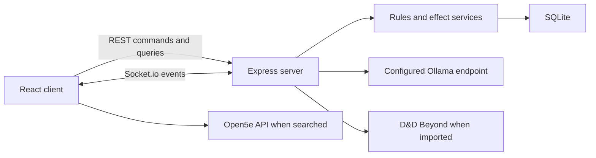

# Architecture

Arcane Ally is a React client and Node.js application server connected by REST and Socket.io, with SQLite as the authoritative campaign store.



## Entry Points

| Area | Entry point | Role |
|---|---|---|
| Client | `client/src/main.tsx` | React bootstrap |
| Routes | `client/src/App.tsx` | Browser routes and application shell |
| Shared client state | `client/src/context/GameContext.tsx` | Socket lifecycle, normalized party state, DM token |
| Backend | `server/server.js` | Express routes, Socket.io handlers, broadcasts |
| Schema | `server/schema.js` | Startup migrations and seed defaults |
| Database | `server/db.js` | Better-SQLite3 connection and WAL mode |

## State Model

Arcane Ally separates permanent character data from table-session state.

- `characters` stores the base sheet: identity, class, level, maximum HP, equipment, attacks, features, and imported source data.
- `session_states` stores current HP, temporary HP, used resources, active conditions, buffs, concentration, and death saves.
- `initiative_tracker` stores encounter ordering and monster/PC combat state.
- `effect_events` stores the combat ledger and provenance records.
- `combat_sessions` groups live and archived encounter events.
- `campaign_state` stores server-wide settings such as automation policies and the current DM session token.

Character resolution happens in `server/lib/rulesIntegration.js` and `server/lib/rulesEngine.js`, which combine the base sheet, session state, equipment, conditions, auras, and enabled automation policies.

## Real-Time Mutation Flow

1. A client emits a command or sends an API request.
2. The server validates the request and applies rules.
3. SQLite is mutated inside the relevant transaction boundary.
4. An audit/timeline event is written when the action is traceable.
5. The server projects state for the receiving role.
6. Socket.io broadcasts the projected state to connected clients.

Clients do not authoritatively merge campaign mutations. They normalize the server payload and render the resulting state.

## Role-Safe Projection

`server/lib/clientStateProjection.js` creates DM, player, public, and cast-safe payloads. Hidden monsters remain DM-only, cast views receive broad monster health labels, and a registered player receives private details only for the owned character.

This projection protects broadcast visibility. It does not make every REST mutation route authenticated; deployments still require the trusted-network controls described in [SECURITY.md](../SECURITY.md).

## Automation and Combat History

`server/lib/automationRules.js` normalizes campaign policies. Combat and effect services consult those policies for unconscious handling, concentration, bloodied state, modifier propagation, ammunition, turn triggers, auras, reactive handlers, initiative sync, and archive retention.

The timeline is append-oriented. Undo creates a correction event and marks the original record as reversed. Ending combat archives the current `combat_session`; retention pruning applies only to archived sessions.

## Authentication Boundaries

`POST /api/auth/dm` validates the configured PIN and stores one current DM token. Selected REST routes and DM Socket.io room membership validate that token. A successful login rotates it, invalidating the previous token.

Some older DM routes still accept a PIN header, and many campaign mutation routes assume a trusted network. Arcane Ally is not a multi-user identity or authorization platform.

## External Integrations

- Ollama receives AI prompts at `OLLAMA_URL`.
- D&D Beyond is contacted for character imports and synchronization.
- Open5e is contacted directly by the client for SRD searches.
- WebRTC voice traffic is negotiated between browsers; secure contexts are required outside `localhost` in most browsers.

## Repository Layout

```text
client/                 React application
  src/components/       Reusable and domain UI
  src/context/          Shared real-time state
  src/pages/            Route-level views and Arcane Codex
server/                 Express and Socket.io backend
  lib/                  Rules, projections, auth, policy helpers
  routes/               REST route modules
  services/             Effect, retention, and combat services
  test/                 Vitest coverage
docs/                   Living technical documentation
files/                  Historical parser/rules prototypes
```
